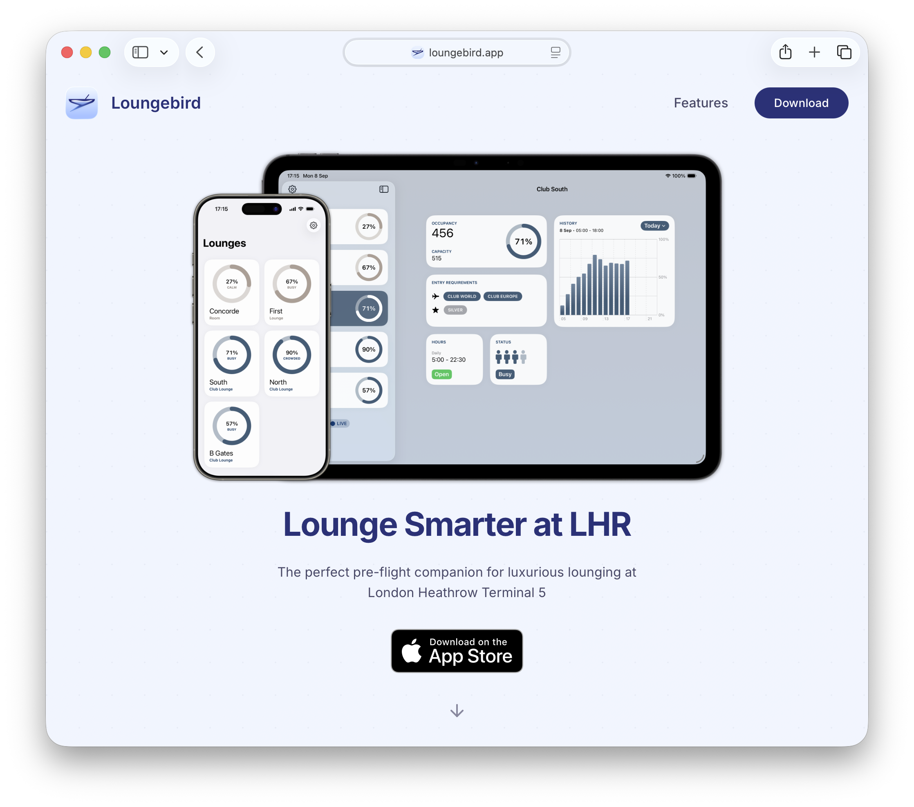

# Loungebird Website

Landing page for Loungebird - real-time lounge occupancy insights for London Heathrow Terminal 5.

## Tech Stack

- React 19 + TypeScript
- Vite
- Framer Motion (animations)
- React Router (SPA routing)
- CSS Modules

## Development

### Prerequisites

- [Volta](https://volta.sh/) (recommended) - automatically uses correct Node.js and pnpm versions
- Or manually: Node.js 24+ and pnpm 9+

### Install dependencies

```bash
pnpm install
```

### Start development server

```bash
pnpm dev
```

### Build for production

```bash
pnpm build
```

### Preview production build

```bash
pnpm preview
```

## Deployment

### Vercel

The site automatically deploys to Vercel on pushes. Pushes to `main` will deploy to production.

### Docker

Build and run with Docker:

```bash
# Build the image
docker build -t loungebird-website .

# Run the container
docker run -p 8080:80 loungebird-website
```

Or use Docker Compose:

```bash
docker compose up
```
